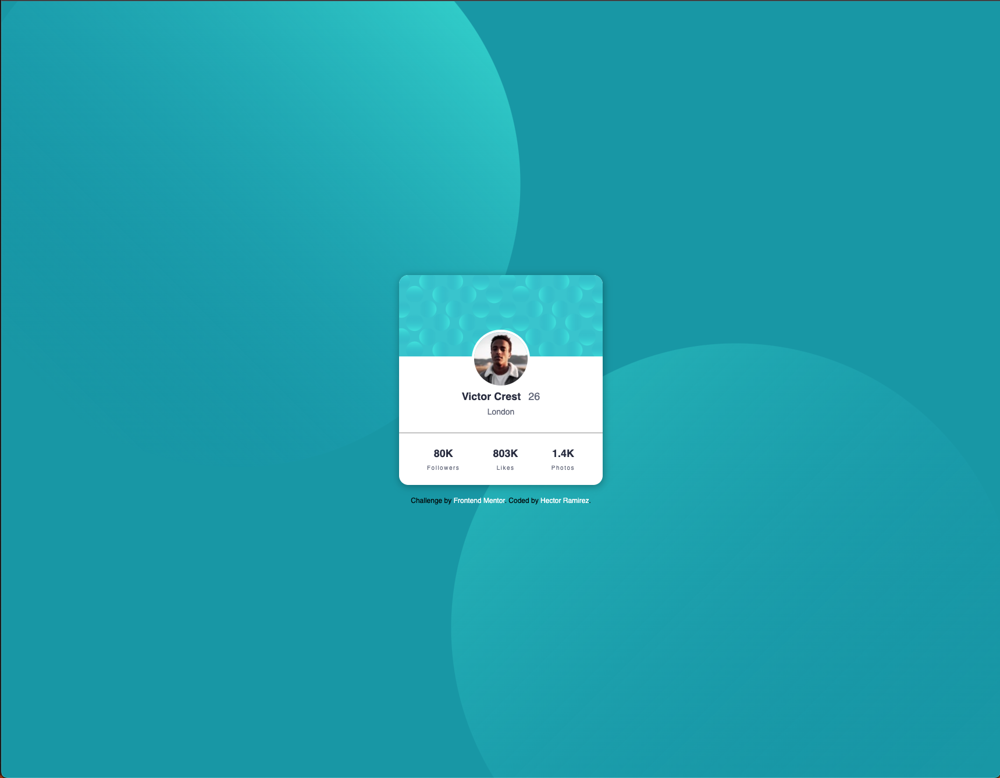

# Frontend Mentor - Profile card component solution

This is a solution to the [Profile card component challenge on Frontend Mentor](https://www.frontendmentor.io/challenges/profile-card-component-cfArpWshJ). Frontend Mentor challenges help you improve your coding skills by building realistic projects.

## Table of contents

- [Overview](#overview)
  - [The challenge](#the-challenge)
  - [Screenshot](#screenshot)
  - [Links](#links)
- [My process](#my-process)
  - [Built with](#built-with)
  - [What I learned](#what-i-learned)
  - [Continued development](#continued-development)
  - [Useful resources](#useful-resources)
- [Author](#author)

**Note: Delete this note and update the table of contents based on what sections you keep.**

## Overview

### The challenge

- Build out the project to the designs provided

### Screenshot



### Links

- Solution URL: (https://github.com/hectorlil48/profile-card-component-main.git)
- Live Site URL: (https://hectorlil48.github.io/profile-card-component-main/)

## My process

### Built with

- Semantic HTML5 markup
- CSS custom properties
- Flexbox

### What I learned

I learned how to add a background image and change the position. I also learned how to make and add a box shadow to my card. I got some more practice using flexbox.

```css
body {
  font-family: "Kumbh Sans", sans-serif;
  min-height: 100vh;
  background-color: var(--dark-cyan);
  display: flex;
  justify-content: center;
  align-items: center;
  background-image: url("../images/bg-pattern-top.svg"),
    url("../images/bg-pattern-bottom.svg");
  background-repeat: no-repeat, no-repeat;
  background-position: right 48vw bottom 40vh, left 45vw top 44vh;
}

.card-content {
  max-width: 350px;
  border-radius: 16px;
  text-align: center;
  overflow: hidden;
  background-color: #fff;
  -webkit-box-shadow: 1px 2px 14px 0px rgba(0, 0, 0, 0.34);
  -moz-box-shadow: 1px 2px 14px 0px rgba(0, 0, 0, 0.34);
  box-shadow: 1px 2px 14px 0px rgba(0, 0, 0, 0.34);
}
```

### Continued development

I want to keep practicing using flexbox to layout my websites. I would also like to get more practice using position absolute and relative.

### Useful resources

- [Google](https://www.google.com) - If I get stuck I always turn to Google to find out what I need to do.
- [stackoverflow](https://stackoverflow.com/) - Usually my Google searches lead me to this website, which I find very useful reading through what other people have gone through.

## Author

- Website - [Hector Ramirez](https://www.hectoramirez.com)
- Frontend Mentor - [@hectorlil48](https://www.frontendmentor.io/profile/hectorlil48)
- LinkedIn - [@HectorRamirez](linkedin.com/in/hector-ramirez-6a6509170)
